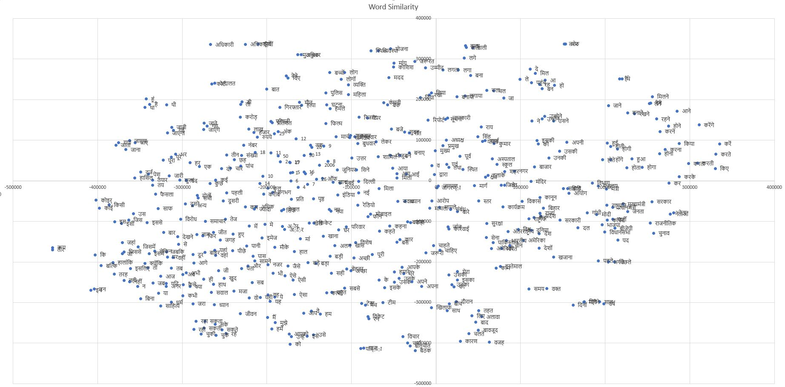
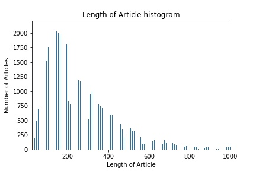

# DeepNews [](https://opensource.org/licenses/Apache-2.0)

Generates headline out of a given text of data.

DeepNews is a high-level news generating tool, written in Python and capable of running on top of either [Keras](https://github.com/fchollet/keras), [TensorFlow](https://github.com/tensorflow/tensorflow) or [Theano](https://github.com/Theano/Theano). It was developed for a media orgnizations or writters where they can quickly come up with headline that is short and information conveying. 

- - - -

## Getting started


### Installing

DeepNews in written on top of Python and Keras, ThensorFlow and Theano. 

>Installing Python:

* [Anaconda](https://www.continuum.io/downloads) - Comes with prebuild libraries like Pandas, Numpy, Scipy, etc. (Recommended) 
* [Official Python website](https://www.python.org/downloads/)

>Installing Keras

* ``` sudo pip install keras ``` 
* Windows Based System can follow this steps [Stackoverflow](http://stackoverflow.com/questions/34097988/how-do-i-install-keras-and-theano-in-anaconda-python-2-7-on-windows) 

>Installing TensorFlow

* [Official site](https://www.tensorflow.org/install/)  

>Amazon AWS 
(All libraries are installed in the AMI image)

* G2 or P2 (GPU) based instances
* [Amazon Machine Image AMI](https://aws.amazon.com/marketplace/pp/B06VSPXKDX)
* GPU configuration are enabled (by default)

Neural networks are computations heavy, GPU configuration is recommended. 

- - - -

### Deep News

`Import` model

```python
from deepnews import *
```

`Train` model

```python
#Fill code to train new dataset
```

`Test` model

```python
#Fill code to test new dataset
```

Using `Pretrained` model
```python
#Fill code on how to use pretrained model
```

`Evaluate` Model
```python
#Fill code on how to use evaluate results
```

`Text Preprocessing`
```python
#Fill code on how to use text preprocessing
```

In the examples folder of the repository, you will find more examples.

- - - -

## Word2Vec (Hindi Language)


### Pretrained word2vec

>Word2Vec pretrained model weights

* [Model Weights (zip)](https://drive.google.com/open?id=0Bw35nAjs4lJbN3lhaFR4NDlSdWs)  

>Dataset 

* We trained our word2vec model from two sources of data. We crawled Indian news websites to collect hindi news. Another dataset we gathered from Forum for Information Retrieveal Evaluation  ([FIRE](http://fire.irsi.res.in/fire/2016/home)). We are releasing our dataset for further use. To get FIRE dataset, contact to orgnization on provided URL above. 
* Data contains one news per line. One news contain Headline and its description. * Head and Description is seprated by special `#|#` tag. (Note we didn't use space or comma as seperator as they can come in news.)
* [Data (zip)](https://drive.google.com/open?id=0Bw35nAjs4lJbRlliVVFMQ0hHUVk)  
* [Fire Dataset Website](http://fire.irsi.res.in/)
* [Seed list](https://github.com/kabrapratik28/DeepNews/blob/master/data/seed_list.txt)

>Loading word2vec 

`Install Genesim`
```python
sudo pip install genesim
```

`Using Pretrained word2vec model` Download above zip and put unzip file in same folder where your code is present.

```python
>>> from gensim.models.keyedvectors import KeyedVectors
>>> model = KeyedVectors.load_word2vec_format("word2vec_hindi.txt", binary=False)
>>> print model.most_similar(u"भारत")

#DON'T WORRY IF YOU SEE SOME HAPHAZARD STRINGS
#TO SEE IN NICE WAY, write this strings to file via codecs
>>>
भारतीय 0.544360220432
चीन 0.516659975052
‘भारत 0.514147996902
अमेरिका 0.506355285645
भ्राात 0.503696322441
पाकिस्तान 0.502107143402
श्रीलंका 0.497614085674
भारतीयों 0.482981711626
कोरिया 0.482506453991
ऑस्ट्रेलिया 0.47489964962
```

`To look above data in neat format, please write it in a file` Look at example shown in [this code](https://github.com/kabrapratik28/DeepNews/blob/master/word2vec/train.py#L28)  


`similarity score example`
```python
>>> model.doesnt_match(u"भारत चीन सिंह अमेरिका".split())
>>> सिंह
```

`Hindi Word Similarity Plot`


`Hindi Word Similarity Translated Plot`


For more examples look at genesim [page here](https://radimrehurek.com/gensim/models/word2vec.html).


## Dataset Statistics

`Length of Article histogram`





`Length of Headline histogram`


### FIRE Dataset stats

| features                                                                                              | values              |
|-------------------------------------------------------------------------------------------------------|---------------------|
| no of articles                                                                                        | 2,97,965            |
| no of tokens                                                                                          | 85,940,081 (85.94M) |
| no of unique tokens in articles                                                                       | 3,88,449            |
| no of unique tokens in headlines                                                                      | 58,448              |
| avg length of article                                                                                 | 272                 |
| avg length of headline                                                                                | 7                   |
| size of dataset                                                                                       | 1.06GB              |
| avg. of (ratio len(article)/len(headline)) (Behind 43 words of description,  headline contain 1 word) | 43                  |


### Crawled Dataset stats

| features                                                                                              | values              |
|-------------------------------------------------------------------------------------------------------|---------------------|
| no of articles                                                                                        |                     |
| no of tokens                                                                                          |                     |
| no of unique tokens in articles                                                                       |                     |
| no of unique tokens in headlines                                                                      |                     |
| avg length of article                                                                                 |                     |
| avg length of headline                                                                                |                     |
| size of dataset                                                                                       |                     |
| avg. of (ratio len(article)/len(headline)) (Behind 43 words of description,  headline contain 1 word) |                     |

### Number of Crawled Articles per source

| News Website      | Number of Articles | URL                                                |
|-------------------|--------------------|----------------------------------------------------|
| Aaj Tak           | 92765              | http://www.aajtak.intoday.in                       |
| ABP News          | 13654              | http://www.abpnews.abplive.in                      |
| Amar Ujala        | 181                | http://www.amarujala.com                           |
| BBC Hindi         | 28861              | http://bbc.com/hindi                               |
| Deshbandhu        | 3174               | http://deshbandhu.co.in                            |
| Economic Times    | 993                | http://hindi.economictimes.indiatimes.com          |
| Jagran            | 73290              | http://www.jagran.com                              |
| Navbharat Times   | 10329              | http://www.navbharattimes.indiatimes.com           |
| NDTV              | 92942              | http://www.khabar.ndtv.com/news/                   |
| News18            | 38833              | http://www.news18.com                              |
| Patrika           | 68288              | http://www.patrika.com                             |
| Punjab Kesari     | 15494              | http://www.punjabkesari.in                         |
| Rajasthan Patrika | 89038              | http://www.rajasthanpatrika.patrika.com            |
| Zee News          | 10463              | http://www.zeenews.india.com/hindi                 |
