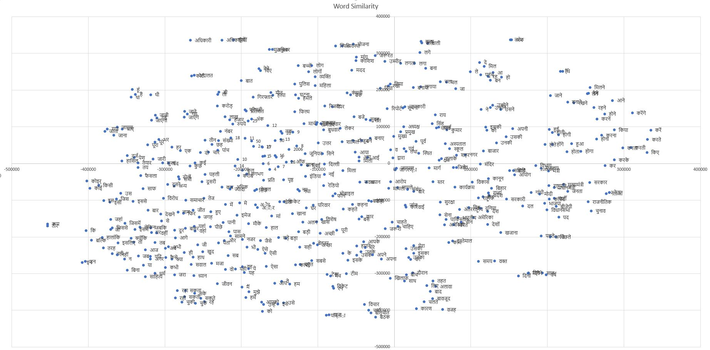
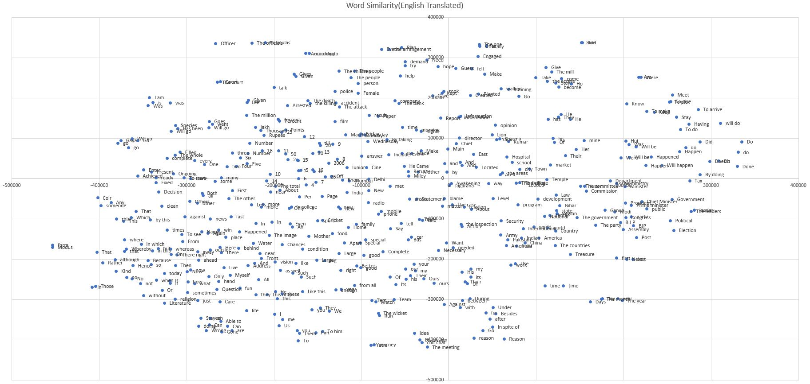
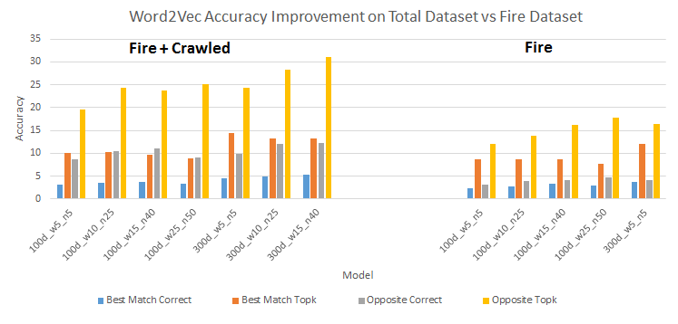
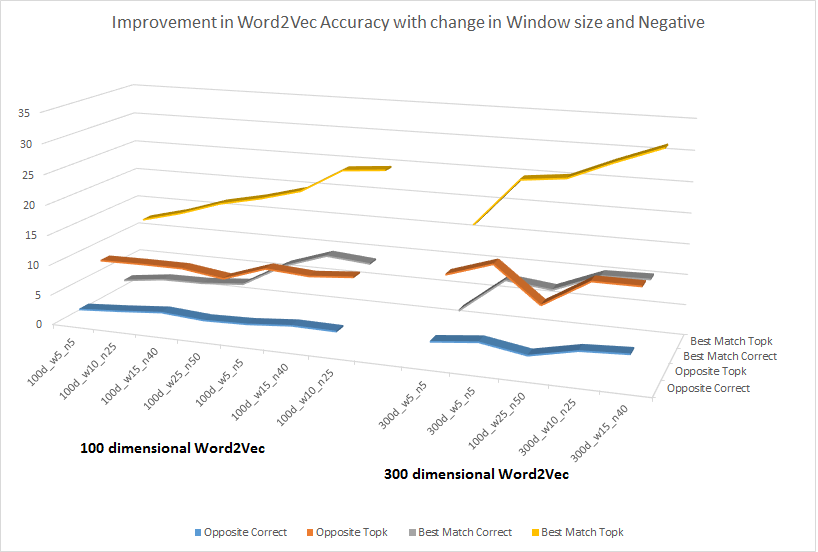

# Word2Vec (Hindi Language)

## Pre-trained word2vec

#### Word2Vec pretrained model weights

* [Model Weights (zip)](https://drive.google.com/open?id=0Bw35nAjs4lJbeF9OMTByRmY2aTQ)  

#### Dataset 

* We trained our word2vec model from two sources of data. We crawled Indian news websites to collect hindi news. Another dataset we gathered from Forum for Information Retrieveal Evaluation  ([FIRE](http://fire.irsi.res.in/fire/2016/home)). We are releasing our dataset for further use. To get FIRE dataset, contact to orgnization on provided URL above. 
* Data contains one news per line. One news contain Headline and its description. * Head and Description is seprated by special `#|#` tag. (Note we didn't use space or comma as seperator as they can come in news.)
* [Data (zip)](https://drive.google.com/open?id=0Bw35nAjs4lJbemlpLW13U2x5RHM)  
* [Fire Dataset Website](http://fire.irsi.res.in/)
* [Seed list](https://github.com/kabrapratik28/DeepNews/blob/master/data/seed_list.txt)

#### Loading word2vec 

`Install Gensim`
```python
sudo pip install gensim
```

`Using Pretrained word2vec model` Download above zip and put unzip file in same folder where your code is present.

```python
>>> from gensim.models.keyedvectors import KeyedVectors
>>> model = KeyedVectors.load_word2vec_format("word2vec_hindi.txt", binary=False)
>>> print model.most_similar(u"भारत")

#DON'T WORRY IF YOU SEE SOME HAPHAZARD STRINGS
#TO SEE IN NICE WAY, write this strings to file via codecs
>>>
भारतीय 0.544360220432
चीन 0.516659975052
‘भारत 0.514147996902
अमेरिका 0.506355285645
भ्राात 0.503696322441
पाकिस्तान 0.502107143402
श्रीलंका 0.497614085674
भारतीयों 0.482981711626
कोरिया 0.482506453991
ऑस्ट्रेलिया 0.47489964962
```

`To look above data in neat format, please write it in a file` Look at example shown in [this code](https://github.com/kabrapratik28/DeepNews/blob/master/word2vec/train.py#L28)  


`similarity score example`
```python
>>> model.doesnt_match(u"भारत चीन सिंह अमेरिका".split())
>>> सिंह
```

`Hindi Word Similarity Plot`


`Hindi Word Similarity Translated Plot`



For more examples look at gensim [page here](https://radimrehurek.com/gensim/models/word2vec.html).


## Word2Vec Statistics

#### Accuracy Improvement With Respect to Dataset 



#### Accuracy Improvement With Respect to Window Size & Negative Parameter



#### Accuracy Improvement Data

<table class="tg">
  <tr>
    <th class="tg-031e"></th>
    <th class="tg-031e"></th>
    <th class="tg-031e" colspan="3">Best Match</th>
    <th class="tg-031e" colspan="3">Opposite</th>
    <th class="tg-yw4l"></th>
    <th class="tg-yw4l"></th>
  </tr>
  <tr>
    <td class="tg-031e"></td>
    <td class="tg-031e">Model</td>
    <td class="tg-031e">Correct</td>
    <td class="tg-031e">TopK</td>
    <td class="tg-031e">Cov*</td>
    <td class="tg-031e">Correct</td>
    <td class="tg-yw4l">TopK</td>
    <td class="tg-yw4l">Cov*</td>
    <td class="tg-yw4l">Avg. Correct</td>
    <td class="tg-yw4l">Avg. Top K</td>
  </tr>
  <tr>
    <td class="tg-031e" rowspan="7">Fire + Crawled</td>
    <td class="tg-031e">100d_w5_n5</td>
    <td class="tg-031e">3.1</td>
    <td class="tg-031e">10.1</td>
    <td class="tg-031e">79.5</td>
    <td class="tg-031e">8.6</td>
    <td class="tg-yw4l">19.6</td>
    <td class="tg-yw4l">61</td>
    <td class="tg-yw4l">5.85</td>
    <td class="tg-yw4l">14.85</td>
  </tr>
  <tr>
    <td class="tg-031e">100d_w10_n25</td>
    <td class="tg-031e">3.6</td>
    <td class="tg-031e">10.2</td>
    <td class="tg-031e">79.5</td>
    <td class="tg-031e">10.4</td>
    <td class="tg-yw4l">24.3</td>
    <td class="tg-yw4l">61</td>
    <td class="tg-yw4l">7</td>
    <td class="tg-yw4l">17.25</td>
  </tr>
  <tr>
    <td class="tg-031e">100d_w15_n40</td>
    <td class="tg-031e">3.7</td>
    <td class="tg-031e">9.6</td>
    <td class="tg-031e">79.5</td>
    <td class="tg-031e">11</td>
    <td class="tg-yw4l">23.7</td>
    <td class="tg-yw4l">61</td>
    <td class="tg-yw4l">7.35</td>
    <td class="tg-yw4l">16.65</td>
  </tr>
  <tr>
    <td class="tg-031e">100d_w25_n50</td>
    <td class="tg-031e">3.3</td>
    <td class="tg-031e">8.8</td>
    <td class="tg-031e">79.5</td>
    <td class="tg-031e">9.1</td>
    <td class="tg-yw4l">25.2</td>
    <td class="tg-yw4l">61</td>
    <td class="tg-yw4l">6.2</td>
    <td class="tg-yw4l">17</td>
  </tr>
  <tr>
    <td class="tg-031e">300d_w5_n5</td>
    <td class="tg-031e">4.5</td>
    <td class="tg-031e">14.5</td>
    <td class="tg-031e">79.5</td>
    <td class="tg-031e">9.9</td>
    <td class="tg-yw4l">24.4</td>
    <td class="tg-yw4l">61</td>
    <td class="tg-yw4l">8.5</td>
    <td class="tg-yw4l">20.8</td>
  </tr>
  <tr>
    <td class="tg-031e">300d_w10_n25</td>
    <td class="tg-031e">4.9</td>
    <td class="tg-031e">13.3</td>
    <td class="tg-031e">78.9</td>
    <td class="tg-031e">12.1</td>
    <td class="tg-yw4l">28.3</td>
    <td class="tg-yw4l">61</td>
    <td class="tg-yw4l">8.5</td>
    <td class="tg-yw4l">20.8</td>
  </tr>
  <tr>
    <td class="tg-031e">300d_w15_n40</td>
    <td class="tg-031e">5.3</td>
    <td class="tg-031e">13.3</td>
    <td class="tg-031e">78.9</td>
    <td class="tg-031e">12.3</td>
    <td class="tg-yw4l">31.1</td>
    <td class="tg-yw4l">61</td>
    <td class="tg-yw4l">8.8</td>
    <td class="tg-yw4l">22.2</td>
  </tr>
  <tr>
    <td class="tg-031e" rowspan="5">Fire</td>
    <td class="tg-031e">100d_w5_n5</td>
    <td class="tg-031e">2.3</td>
    <td class="tg-031e">8.6</td>
    <td class="tg-031e">72.2</td>
    <td class="tg-031e">3.1</td>
    <td class="tg-yw4l">12.1</td>
    <td class="tg-yw4l">38.8</td>
    <td class="tg-yw4l">2.7</td>
    <td class="tg-yw4l">10.35</td>
  </tr>
  <tr>
    <td class="tg-031e">100d_w5_n25</td>
    <td class="tg-031e">2.8</td>
    <td class="tg-031e">8.7</td>
    <td class="tg-031e">72.2</td>
    <td class="tg-031e">4</td>
    <td class="tg-yw4l">13.9</td>
    <td class="tg-yw4l">38.8</td>
    <td class="tg-yw4l">3.4</td>
    <td class="tg-yw4l">11.3</td>
  </tr>
  <tr>
    <td class="tg-031e">100d_w15_n40</td>
    <td class="tg-031e">3.4</td>
    <td class="tg-031e">8.7</td>
    <td class="tg-031e">72.2</td>
    <td class="tg-031e">4.1</td>
    <td class="tg-yw4l">16.2</td>
    <td class="tg-yw4l">38.8</td>
    <td class="tg-yw4l">3.75</td>
    <td class="tg-yw4l">12.45</td>
  </tr>
  <tr>
    <td class="tg-031e">100d_w25_n50</td>
    <td class="tg-031e">2.9</td>
    <td class="tg-031e">7.7</td>
    <td class="tg-031e">72.2</td>
    <td class="tg-031e">4.7</td>
    <td class="tg-yw4l">17.7</td>
    <td class="tg-yw4l">38.8</td>
    <td class="tg-yw4l">3.8</td>
    <td class="tg-yw4l">12.7</td>
  </tr>
  <tr>
    <td class="tg-yw4l">300d_w5_n5</td>
    <td class="tg-yw4l">3.7</td>
    <td class="tg-yw4l">12.1</td>
    <td class="tg-yw4l">72.2</td>
    <td class="tg-yw4l">4.1</td>
    <td class="tg-yw4l">16.4</td>
    <td class="tg-yw4l">38.8</td>
    <td class="tg-yw4l">3.9</td>
    <td class="tg-yw4l">14.25</td>
  </tr>
</table>

*Cov = Coverage
